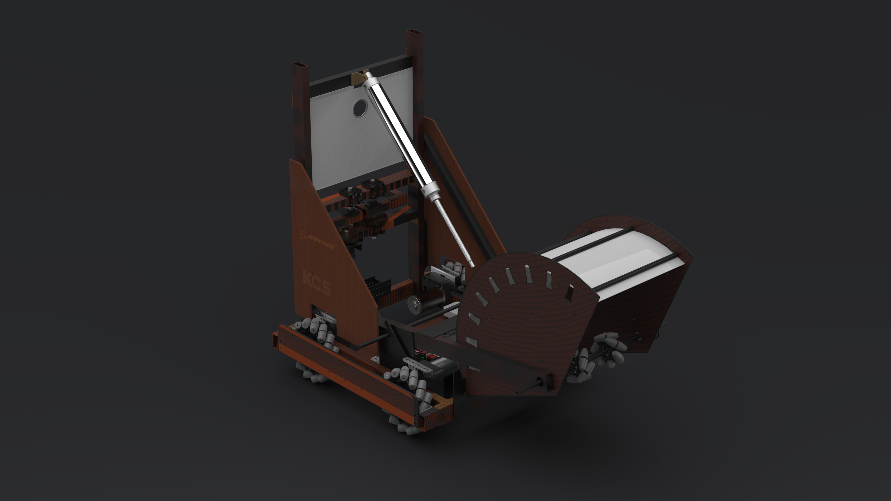

[](https://travis-ci.org/lnstempunks/MarvinTheParanoidAndroid)
[](https://marvintheparanoidandroid.readthedocs.io/en/latest/?badge=latest)

Our code for the 2019 FIRST Robotics Competition Season. This goes with our 2019 robot, QBit.




# Installation

## Clone the repo: 

```git clone https://github.com/lnstempunks/marvintheparanoidandroid```

## Install the needed dependencies with PIP

```pip3 install -r travis.txt```


# Running

## Run PyGame simulator
```python3 robot.py sim```

## Run tests

```python3 robot.py test```

## Deploy to robot
```python3 robot.py deploy```

To edit any changes in IPs or radios, edit or delete the ```.deploy_cfg``` file.


